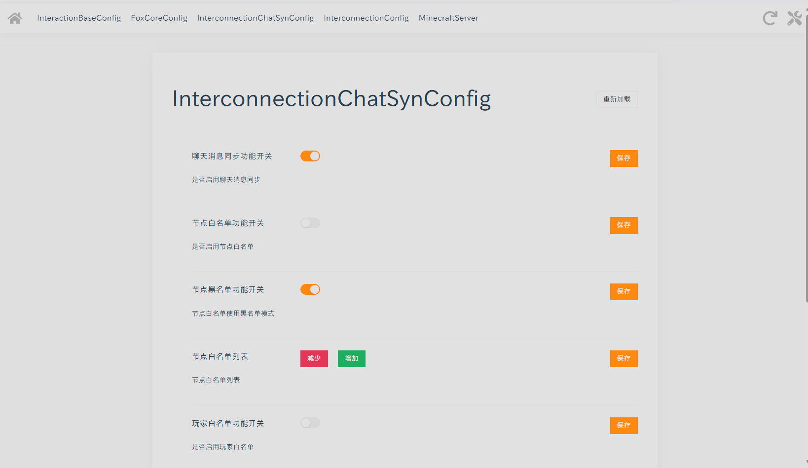
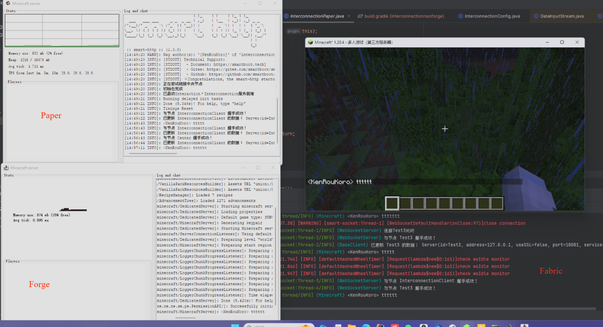

# InterconnectionChatSyn 互联聊天同步
**InterconnectionChatSyn 互联聊天同步**是一个用于在多个不同服务端的Minecraft服务器间进行玩家聊天消息同步的Mod/Plugin。
## 依赖
请安装前置依赖 [FoxCore](https://github.com/KenRouKoro/FoxMCProject) 和 [Interconnection](https://github.com/KenRouKoro/Interconnection)。
## 使用
推荐使用Web配置系统。
### InterconnectionChatSynConfig
| 配置项        | 类型           | 默认值   | 说明                  |
|------------|--------------|-------|---------------------|
| 聊天消息同步功能开关 | bool         | true  | 本Mod/Plugin的总开关     |
| 节点白名单功能开关  | bool         | false | 是否启用节点白名单           |
| 节点黑名单功能开关  | bool         | true  | 节点白名单使用黑名单模式        |
| 节点白名单列表    | String Array |       | 节点白名单列表             |
| 玩家白名单功能开关  | bool         | false | 是否启用玩家白名单           |
| 玩家黑名单功能开关  | bool         | true  | 玩家白名单使用黑名单模式        |
| 玩家白名单列表    | String Array |       | 玩家白名单列表，使用的是UUID匹配  |

对应Web配置系统预览：

游戏内效果预览：
